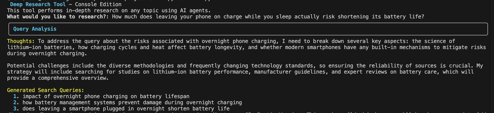
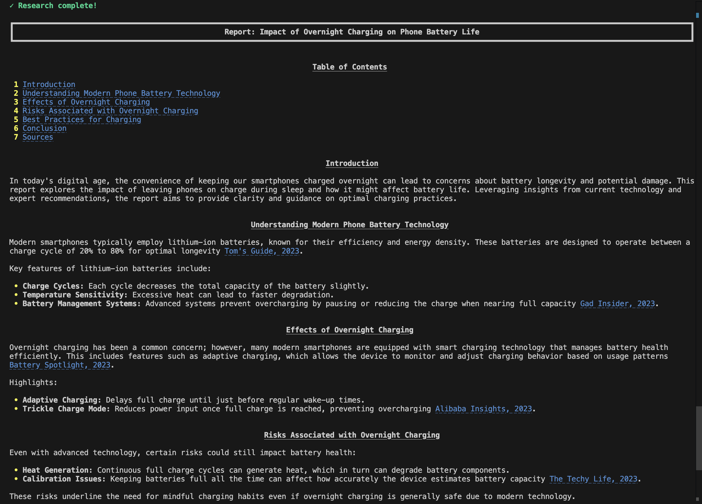
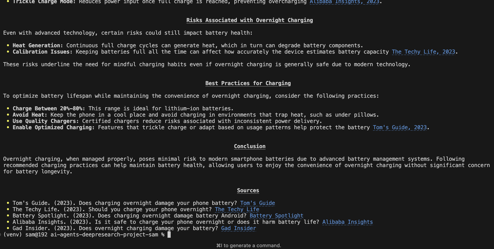

<p align="center">
  
</p>

---

<p align="center">
  
</p>

---

<p align="center">
  
</p>


# 🔍 AI Deep Research Tool

An intelligent multi-agent research system that performs comprehensive, iterative web research on any topic using AI agents and synthesizes findings into detailed reports.

## ✨ Features

- **Multi-Agent Architecture**: Specialized AI agents for query generation, web scraping, analysis, and synthesis
- **Iterative Research**: Automatically identifies knowledge gaps and performs follow-up research
- **Smart Web Scraping**: DuckDuckGo search integration with intelligent content extraction
- **Rich Console Output**: Beautiful terminal UI with real-time progress tracking
- **Comprehensive Reports**: Generates 5-6 page markdown reports with citations and table of contents

## 🏗️ Architecture

The system uses four specialized AI agents:

1. **Query Agent** - Analyzes user input and generates targeted search queries
2. **Search Agent** - Scrapes and summarizes web content from search results
3. **Follow-up Agent** - Evaluates research completeness and generates follow-up queries
4. **Synthesis Agent** - Combines findings into a comprehensive research report

## 🚀 Quick Start

### Prerequisites

- Python 3.10+
- OpenAI API key

### Installation

```bash
# Clone the repository
git clone https://github.com/samebrave/AI-Agents-Deep-Research-Tool.git

# Create virtual environment
python -m venv venv
source venv/bin/activate  # On Windows: venv\Scripts\activate

# Install dependencies
pip install -r requirements.txt

# Set up environment variables
# Add your OPENAI_API_KEY to .env
